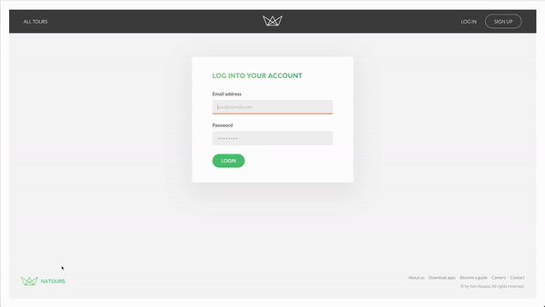
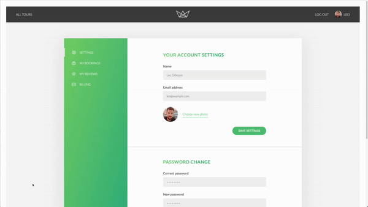

## Natours

Natours is a full-featured web application that uses Node.js, Express, and MongoDB to provide an interactive platform for booking tours.

### Features

#### User Authentication

The application includes a complete user authentication system, allowing users to sign up, log in, and log out. The authentication system uses JSON Web Tokens (JWT) for session management.

- Signup: Users can sign up by providing their name, email, password, password confirmation, role, password reset token, and password reset expiry​​.

- Login: Users can log in by providing their email and password. The application checks if the provided email and password exist and match the ones in the database. If the login attempt is successful, the application sends a JWT to the client​​.

- Logout: Users can log out, and upon logging out, the client's JWT is replaced with a "logged out" token, effectively ending the session​​.

- Protect: The application includes a middleware function to protect routes. The function checks if a JWT is present and valid. If the JWT is valid, the function retrieves the user from the database and checks if the user still exists and if the user has changed their password after the JWT was issued. If all checks pass, the user is granted access to the route​​.

## Here is the demo:

1. Home page

   

2. Login & User page

   

3. UpdateDate

   
